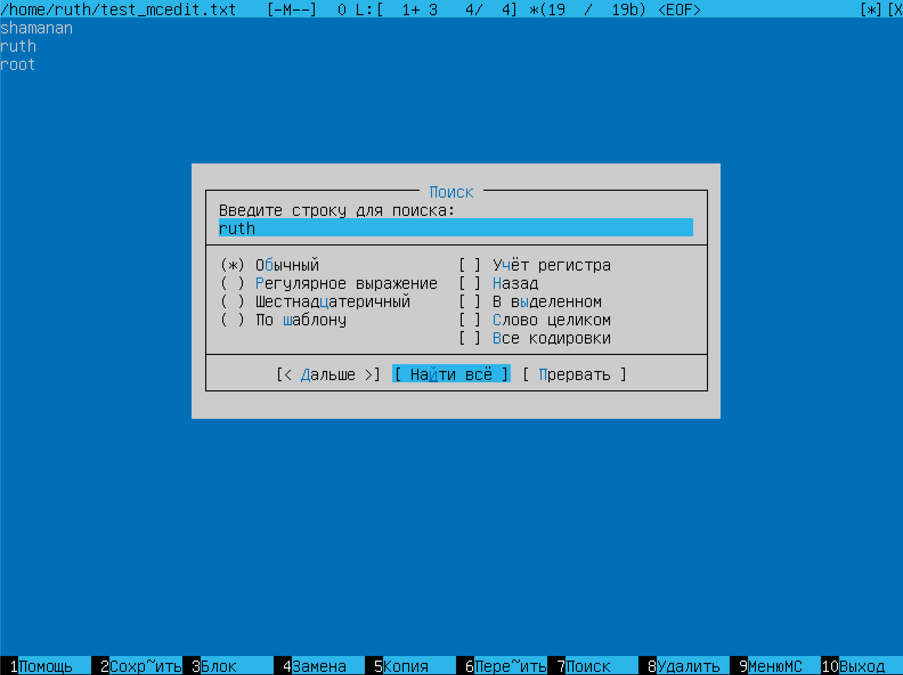
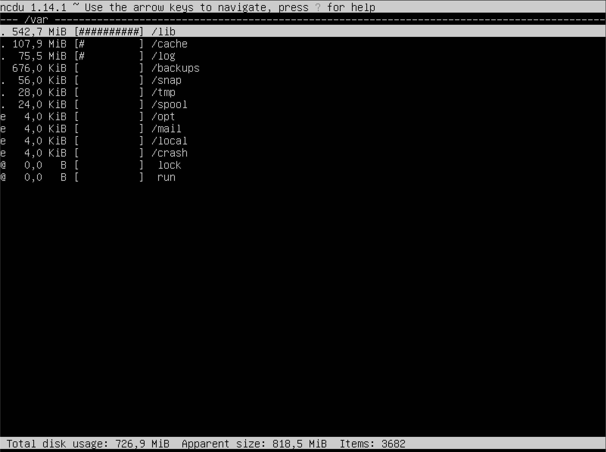

## Part 1. Установка ОС

- ``Смотрим версию Ubuntu после установки `` 
 

---

## Part 2. Создание пользователя
- ``Создаём пользователя и назначаем ему группу adm`` 
 

- ``Вывод списка пользователей: cat /etc/passwd`` 
 

---
## Part 3. Настройка сети ОС

- ``Установили новое имя машины и вывели его в терминал`` 
 

- ``Установили новую временную зону и вывели информацию в терминал`` 
 

- ``Установили набор сетевых инструментов командой: sudo apt install net-tools`` 

- ``Вывели информацию о сетевых интерфейсах`` 
 
- ``Произвели перезгрузку системы, чтобы все отображалось коректно`` 
 
- **lo (loopback device)** – виртуальный интерфейс, присутствующий по умолчанию в любом Linux. Он используется для отладки сетевых программ и запуска серверных приложений на локальной машине. С этим интерфейсом всегда связан адрес 127.0.0.1. У него есть dns-имя – localhost.

- ``Получили ip адрес устройства, на котором работаем, от DHCP сервера.`` 
 

- **DHCP (Dynamic Host Configuration Protocol)** -протокол динамической конфигурации хоста, который позволяет устройствам автоматически получать IP-адрес, настройки сети и другую информацию от DHCP сервера.

- ``Узнали внутренний IP-адрес. "default via" - рядом с этой строкой будет указан внешний IP-адрес шлюза (ip). `` 
 

- ``Узнали внешний IP-адрес шлюза. `` 
 

- ``Изменили файл /etc/netplan/*.yaml, применили изменения в netplan, перезагрузились`` 
 
 
- ``Проверяем, что адреса соотсветствуют заданным в предыдущем пункте`` 
 
- ``Успешно пропинговали удаленные хосты 1.1.1.1 и ya.ru`` 
 

---
## Part 4. Обновление ОС
- ``Успешно обновили системыне пакеты с помощью команд "sudo apt update" и "sudo apt upgrade". Проверили обновления`` 
 

---
## Part 5. Использование команды sudo
- **sudo** - команда sudo предоставляет пользователям временные привилегии администратора для выполнения задач, требующих повышенных прав доступа. Это помогает обеспечить безопасность системы, поскольку пользователи должны явно запрашивать повышение привилегий для каждой команды. 
- ``Создали новый файл конфигурации в каталоге /etc/sudoers.d/ с помощью команды "sudo visudo -f /etc/sudoers.d/newuser"`` 
- ``В открывшемся редакторе добавили следующую строку, указав имя пользователя: newuser ALL=(ALL:ALL) ALL`` 
- ``Первое “ALL” означает, что данное правило применяется ко всем хостам.`` 
- ``Второе “ALL” означает, что пользователь newuser может запускать команды от лица всех пользователей.`` 
- ``Третее “ALL” означает, что пользователь newuser может запускать команды от лица всех групп.`` 
- ``Четвертое “ALL” означает, что данные правила применяются всем командам.`` 
- ``Заходим под пользователем newuser используя команду su newuser (созданного в пункте Part 2 (используя sudo)), проверяем работу sudo и меняем hostname ОС.`` 
 
 
---

## Part 6. Установка и настройка службы времени
- ``Вывод команды с корректным временем`` 
 

---
## Part 7. Установка и использование текстовых редакторов
- ``Выбрал и установил VIM, NANO, MCEDIT.`` 

- ``Для установки VIM требуется команда `sudo apt install vim`.``
- ``Для установки NANO требуется команда `sudo apt install nano`.``
- ``Для установки MCEDIT требуется команда `sudo apt install mcedit`.``

### VIM
-  
- ``Для сохранения и выхода нажал ESC и прописал :wq`` 
 
- ``Для выхода без сохранения нажать ESC -> :q! -> ENTER`` 
 
- ``Для поиска написать /что_ищем`` 
 
- ``Для замены написать :s/что_заменить/чем/g`` 
 
---
### NANO
 
- ``Для выхода с сохранением нажать клавишу `comtrol` + `X`, подтвердить изменения клавишей `Y`, нажать `Enter`.`` 
 
- ``Для выхода без сохранения нажать клавишу `comtrol` + `X`, отменить изменения клавишей `N`, нажать `Enter`.`` 
 
- `` Для поиска слова нажать клавишу `comtrol` + `W`, ввести нужное слово в строке Search. Нажать `Enter`. На нужном слове будет установлен указатель.`` 
 
- ``Для замены слова нажать клавишу `comtrol` + `\`, ввести нужное слово в строке "Search(to replace)". Нажать `Enter`. Ввести слово на замену в строке "Replace with". Нажать `Enter`.  Подтвердить замену клавишей `Y`, нажать `Enter`.`` 
 
---
### MCEDIT
-  
- ``Для выхода с сохранением нажать  F2 (yes) + F10`.`` 
 
- ``Для выхода без сохранения нажать F10(no).`` 
 
- ``Для поискф нажать F7 + <текст который ищем> + <ок>`` 
 
 
- ``Для замены нажать F4 + <что хотим изменить> + <на что хотим заменить> + replace`` 
 
 
---
## Part 8. Установка и базовая настройка сервиса SSHD
- ``Установить службу SSHd.``
- ``sudo apt-get install ssh``
- ``sudo apt install openssh-server``
- ``Добавить автостарт службы при загрузке системы.``
 
- ``Перенастроить службу SSHd на порт 2022. (sudo nano /etc/ssh/sshd_config)``
 
- ``sudo service ssh restart``
- ``Используя команду ps, показать наличие процесса sshd. Для этого к команде нужно подобрать ключи.``
- **ps** - встроенная программа, с помощью которой осуществляется мониторинг активных процессов по виртуальным файлам в файловой системе. Данная программа позволяет ориентироваться в том, что конкретно происходит в Linux;  
- ``А - выводит все процессы;``
- ``а - выводит все процессы в текущем терминале;`` 
- ``u - выводит процессы, запушенные пользователем root;``
- ``x - выводит список всех активных процессов;``
- ``С - выводит процессы по имени команды``
- ``e - отображает информацию о всех процессах, включая процессы, связанные с другими пользователями.``
- ``f - отображает полный формат вывода, включая дополнительную информацию о процессах``
 

- ``Выводим статус командой systemctl status sshd``
 

- **netstat** - это команда в системе Linux, которая выводит различную информацию о сетевых подключениях, маршрутизации и сетевых интерфейсах. 
- ``tunl- это набор ключей, которые используются с командой netstat для указания опций вывода информации. Разберем каждый ключ:``
- ``t- отображает только TCP-подключения.``
- ``a- Показывает все соединения, включая активные (ESTABLISHED) и прослушиваемые порты (LISTENING)``
- ``u- отображает только UDP-подключения.``
- ``n- отображает сетевые адреса и порты в числовом формате, а не в виде имен.``
- ``l- отображает только прослушивающие (слушающие) подключения.``
- ``Результат выполнения можно увидеть введя команду netstat -tunl.``
 
 
- ``Proto: Протокол соединения (например, tcp).``
- ``Recv-Q: Количество байт, ожидающих чтения.``
- ``Send-Q: Количество байт, ожидающих отправки.``
- ``Local Address: Локальный IP-адрес и порт.``
- ``Foreign Address: Внешний IP-адрес и порт, с которым установлено соединение.``
- ``State: Состояние соединения (например, ESTABLISHED, LISTENING).``
- ``Значение 0.0.0.0 в столбце Local Address означает, что процесс прослушивает все доступные сетевые интерфейсы на локальном устройстве. Это также известно как "любой адрес" или "все интерфейсы". Процесс принимает входящие соединения на всех IP-адресах, связанных с устройством.``

---

## Part 9. Установка и использование утилит top, htop
- ``Установить и запустить утилиты top и htop``
- ``Установка утилиты "top" выполняется командой "sudo apt install top"``
- ``Запуск утилиты "top" производится командой "top"``
 
- ``Вывод с команды top``
- ``Uptime up 53 min``
- ``Количество авторизованных пользователей 1 user``
- ``Общую загрузку системы 0,04, 0,02, 0,00``
- ``Общее количество процессов 92 total``
- ``Загрузку cpu 0.0``
- ``Загрузку памяти MiB Mem 2660,4 MiB Swap2660,0``
- ``Pid процесса занимающего больше всего памяти 1``
- ``Pid процесса, занимающего больше всего процессорного времени 1root``

- ``Установка утилиты "htop" выполняется командой "sudo apt install htop"``
 
- ``Запуск утилиты "htop" производится командой "htop"``
 
- ``Для того чтбы отсортировать данные используем клавишу F6``
- ``Скрины с сротировкой процессов по: PID``
 
- ``Скрины с сротировкой процессов по: PERCENT_CPU``
 
- ``Скрины с сротировкой процессов по: PERCENT_MEM``
 
- ``Скрины с сротировкой процессов по: TIME``
 
- ``Для фильтрации процесса по sshd используем клавишу меню F4. Вводим в сроку Filter sshd.``
 
- ``Для фильтрации используем клавишу меню F3. Вводим в сроку Search syslog.``
 
- ``Для добавления hostname, clock и uptime нажимаем F2 и в настройках добавляем необходимые атрибуты на дашборд утилиты.``
 
---
## Part 10. Использование утилиты fdisk

- ``Устанавливаем утилиту командами sudo apt update и sudo apt install fdisk. Команда fdisk позволяет задействовать одноименную утилиту для модификации таблиц разделов жестких дисков формата MSDOS.``
- ``Запускаем утилиту командой sudo fdisk -l.``
 
 
- ``Disk /dev/sda, size: 20 GiB, 21474836480 bytes, 41943040 sectors. размер swap с помощью команды swapon --show размер swap 2.6 G``
---
## Part 11. Использование утилиты df

-  
- ``Запустить команду df.``
- ``В отчёте написать для корневого раздела (/):``
 
- ``размер раздела - 20463184;``
- ``размер занятого пространства - 5603136;``
- ``размер свободного пространства - 13795244;``
- ``процент использования - 29 %;``
- ``Определить и написать в отчёт единицу измерения в выводе - килобайт``

- ``Запустить команду df -Th.``
 
- ``В отчёте написать для корневого раздела (/):``
- ``размер раздела - 20G;``
- ``размер занятого пространства - 5.4G;``
- ``размер свободного пространства - 15G;``
- ``процент использования - 29%``
- ``Определить и написать в отчёт тип файловой системы для раздела - ext4.``

---
## Part 12. Использование утилиты du
- ``Запустить команду du.``
- ``Вывести размер папок /home, /var, /var/log (в человекочитаемом виде)``
 
- ``Вывести размер всего содержимого в /var/log (не общее, а каждого вложенного элемента, используя *)``
 
---
## Part 13. Установка и использование утилиты ncdu
- ``Установить утилиту ncdu.``
- ``sudo apt-get install ncdu``
- ``Вывести размер папок /home, /var, /var/log.``
- ``/home``
 
 
- ``/var``
 
- ``/var/log``
 
---

## Part 14. Работа с системными журналами
- ``Открыть для просмотра:``
- ``/var/log/dmesg``
 
- ``/var/log/syslog``
 
- ``/var/log/auth.log``
 
- ``Последняя авторизация`` 
 
- ``Перезапуск OpenSSH Server и отчет о рестарте`` 
 
---

## Part 15. Использование планировщика заданий CRON

- ``crontab -e Редактирование или создание файла расписания для текущего пользователя;``

- ``crontab -l Вывод содержимого расписания текущего пользователя;``

- ``crontab -r Удаление файла расписания текущего пользователя;``

- ``crontab -u user Работа с расписаниями конкретных пользователей.``

- ``Вызываем crontab -e, выбираем редактор``
 
- ``Записываем команду uptime через каждые 2 минуты``
 
- ``Информация о выполнении uptime каждые 2 минуты (cat /var/log/syslog)``
 
- ``Смотрим cписок текущих заданий для CRON crontab -l``
 
- ``Удаляем все задания из планировщика заданий crontab -r проверяем crontab -l``
 